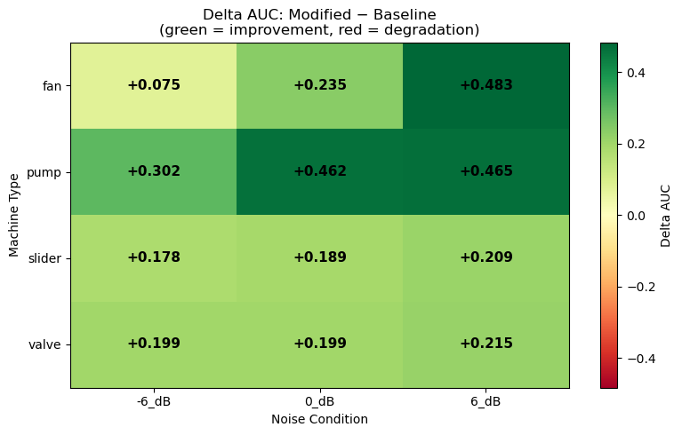
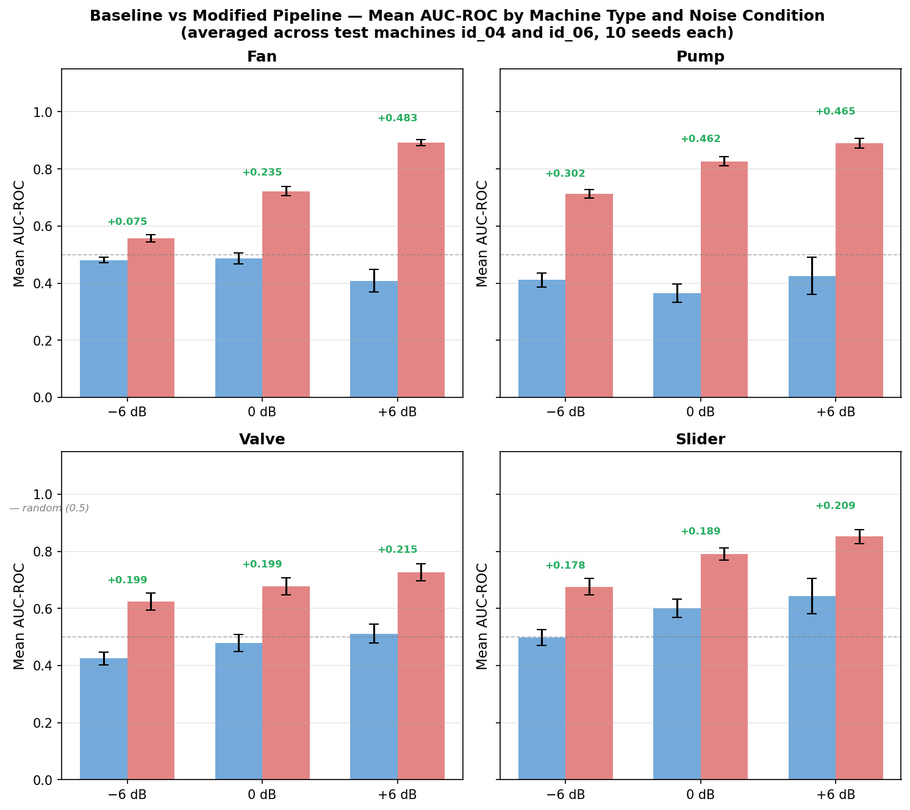
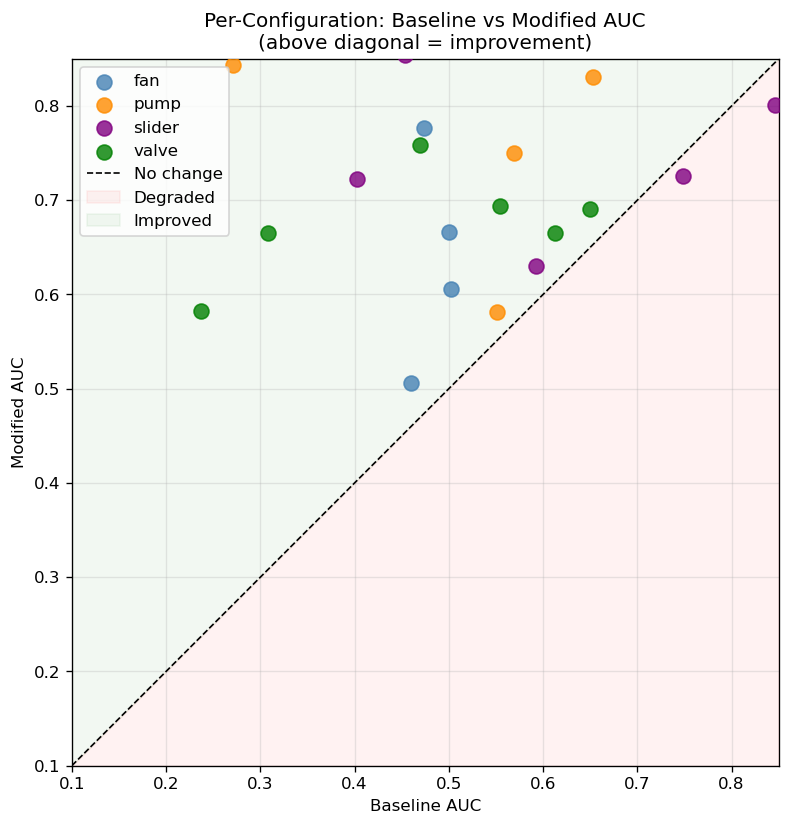
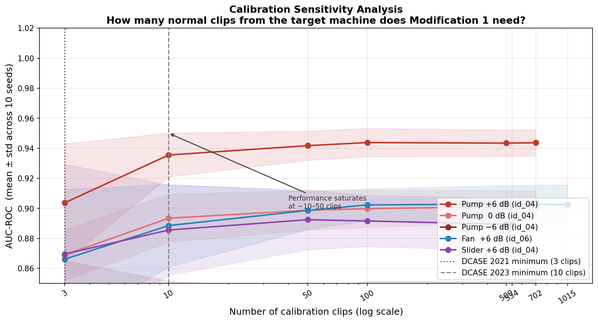
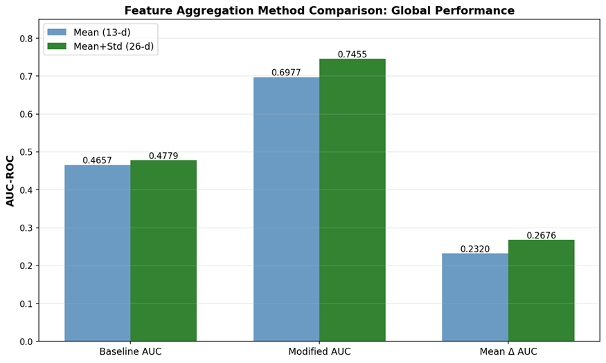
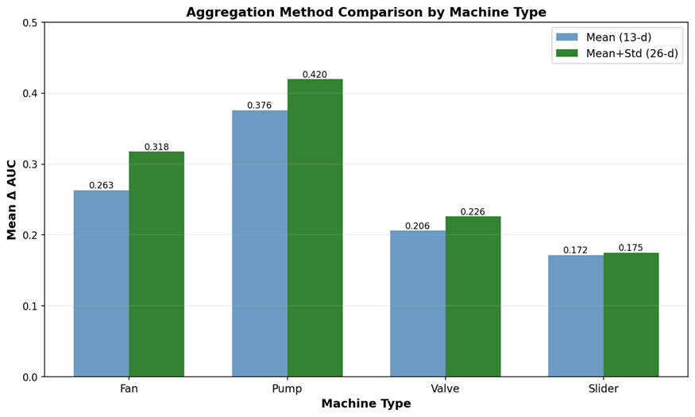

# Sound-Based Anomaly Detection in Industrial Machines
### Reducing Cross-Machine Domain Shift via Preprocessing-Only Feature Engineering
 
---
 
## Overview
 
Industrial machines of the same type sound different even when healthy — each physical unit has its own acoustic signature due to bearing tolerances, material properties, and assembly differences. This is the **cross-machine domain shift problem**: a model trained on machines id_00 and id_02 fails on id_04 not because id_04 is broken, but because it simply sounds different.
 
This project investigates whether two interpretable, lightweight preprocessing modifications can close that gap — without deep learning, without GPU, and without retraining for each new machine. We use **Isolation Forest** as the anomaly detector and evaluate on the **MIMII dataset** (fans, pumps, valves, and sliding rails) across 24 configurations, 10 random seeds each.
 
**Two preprocessing modifications:**
- **Modification 1 — Per-machine-ID normalisation:** Subtracts each machine's mean MFCC vector from all its clips, removing acoustic identity and leaving only deviations from normal behaviour.
- **Modification 2 — Variance-weighted MFCC selection:** Downweights MFCC coefficients that encode machine identity (high between-machine variance) rather than fault state (high within-machine variance).
---

## Key Results

Experiments across 24 configurations (4 machine types × 3 noise conditions × 2 unseen test
machines), averaged over 10 random seeds each, using **mean+std aggregation (26-d features)**:

| Pipeline | Mean AUC-ROC | Configs improved |
|----------|-------------|-----------------|
| Baseline (no preprocessing) | 0.4779 | — |
| Modified (both modifications) | 0.7455 | 22/24 (92%) |
| **Delta** | **+0.2676** | — |

### Improvement by Machine Type

| Machine | Mean Delta AUC | Min | Max |
|---------|---------------|-----|-----|
| Pump    | +0.4096 | +0.031 | +0.753 |
| Fan     | +0.2646 | +0.047 | +0.557 |
| Valve   | +0.2043 | +0.042 | +0.357 |
| Slider  | +0.1920 | −0.044 | +0.462 |

### Improvement by Noise Condition

| Condition | Mean Delta AUC |
|-----------|---------------|
| +6 dB     | +0.343 |
|  0 dB     | +0.271 |
| −6 dB     | +0.189 |

The modifications show the largest gains at high SNR (+6 dB) for pump machines, where domain
shift was most severe. The baseline was actively inverted for several pump configurations
(AUC < 0.3), meaning the model was ranking normal sounds as more anomalous than faulty ones.

**Largest single improvement:** Pump id_04 at +6 dB:

| | Baseline | Modified | Delta |
|-|----------|----------|-------|
| AUC-ROC | 0.197 ± 0.031 | 0.962 ± 0.006 | **+0.765** |

### Calibration Sensitivity

As few as 10 normal clips from the target machine are sufficient to achieve near-maximum
performance (within 0.001–0.013 of the full-dataset ceiling). Performance saturates between
10 and 50 clips across all tested configurations.

This is consistent with the DCASE 2021 benchmark which supplies exactly 3 target-domain clips —
confirming the method is practical under minimal data constraints.

### Aggregation Method Comparison (mean vs mean+std)

| Machine | Delta AUC (mean, 13-d) | Delta AUC (mean+std, 26-d) | Difference |
|---------|----------------------|--------------------------|------------|
| Fan     | +0.2108 | +0.2646 | +0.054 |
| Pump    | +0.3652 | +0.4096 | +0.044 |
| Valve   | +0.1891 | +0.2043 | +0.015 |
| Slider  | +0.1643 | +0.1920 | +0.028 |

Mean+std consistently outperforms mean-only. The standard deviation captures temporal
variability in the MFCC signal — how much each coefficient fluctuates over the 10-second clip —
which carries additional information about machine operational state.

